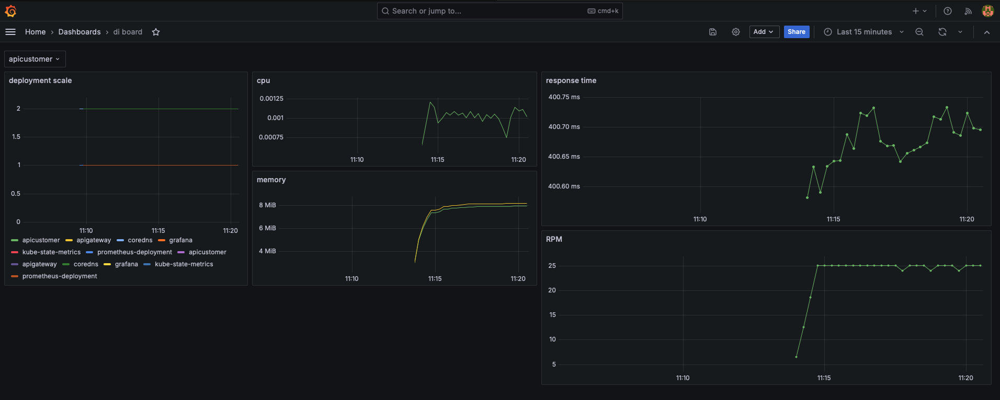
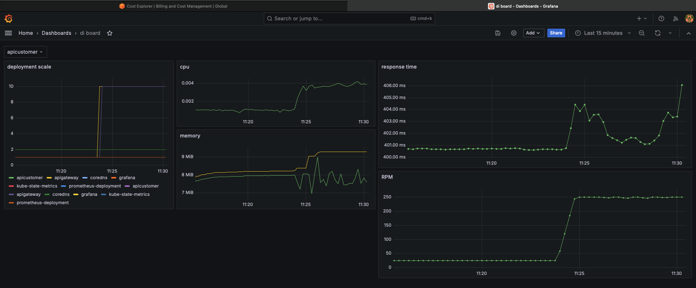
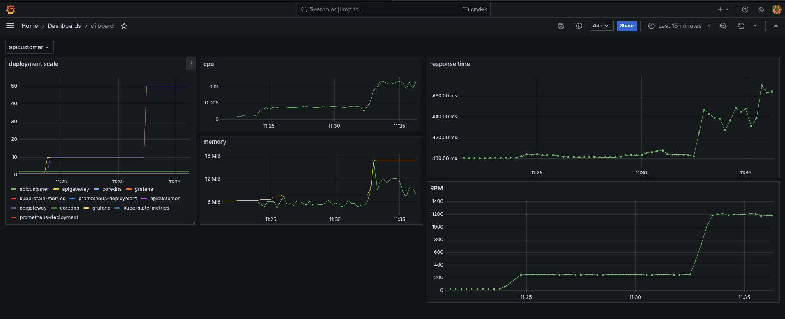
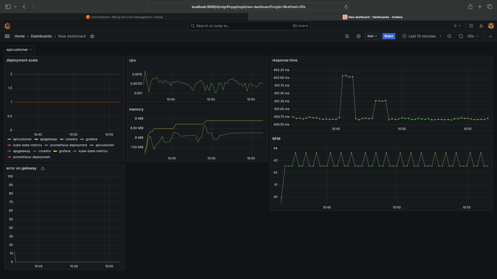
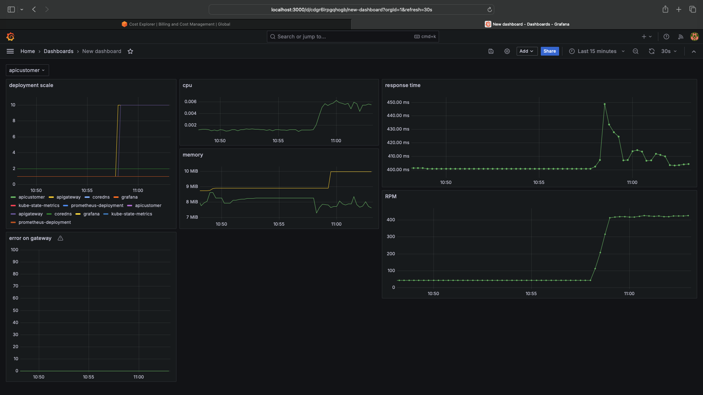
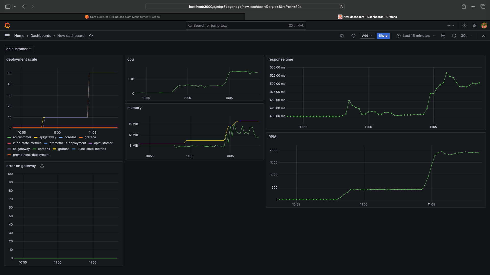
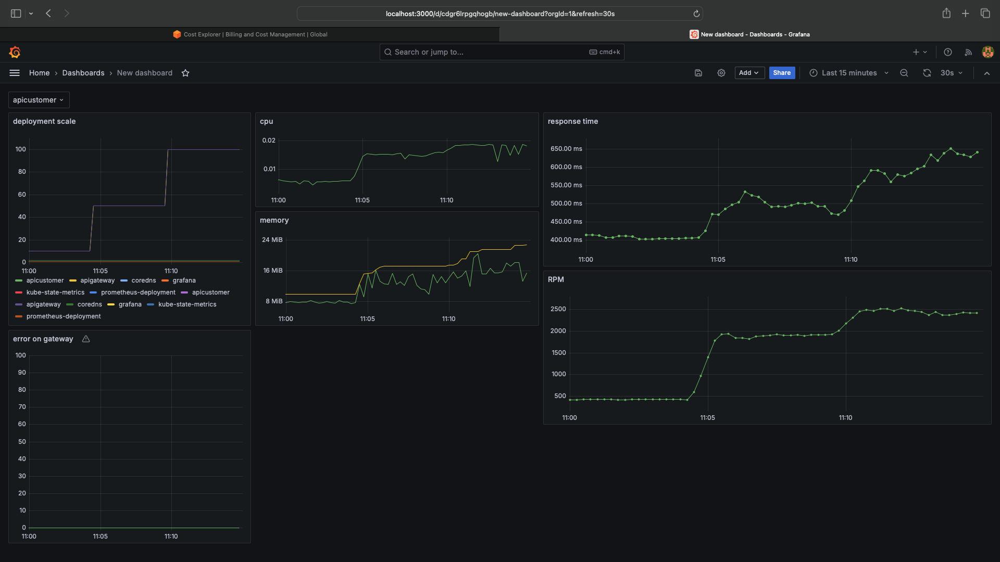

# devops training

## observation

### resource k8s

100m = 0.10 cores
20Mi = 20MiB

# task

## Day 1

### part 1

at first, I wanna see how a simple system works.
app one is called gateway and it's a golang api.
the second one is called customer, also a golang api.
will only be 2 apps, one(gateway) to make the call using polling and another(customer) to receive the call.
the second one, will have a response greater than 400ms (provided with sleep function).
the gateway api will make a request every 100ms.

### part 2

increase the quantity of caller(gateway), so I can see how the api-customer handle this.

- increase by 10
  
- increase by 50
  
- increase by 100
  

## Day 2

### part 1

### part 2

- increase by 10
  
- increase by 50
  
- increase by 100
  
